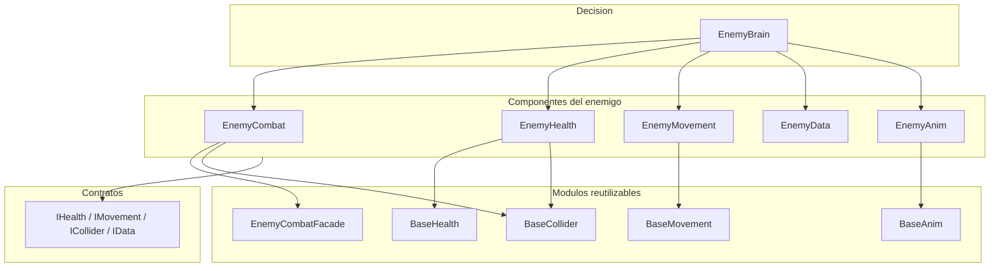

# Arquitectura

El sistema se organiza alrededor de una composicion de componentes. `EnemyBrain` coordina el comportamiento, pero delega cada responsabilidad especializada a un modulo.

## Capas

## Principios utilizados

### Composicion

El cerebro no implementa el movimiento ni el dano directamente. Solicita servicios a componentes especializados mediante interfaces o referencias concretas.

### Separacion entre configuracion y estado

Los `ScriptableObject` contienen valores reutilizables. El estado temporal, como el objetivo actual, el cooldown restante o la coroutine activa, permanece en los componentes de escena.

### Consultas sin efectos secundarios

Las consultas de rango y disponibilidad no deben consumir una habilidad. La reserva de una habilidad ocurre unicamente al ejecutar `TryExecuteATK`.

### Eventos

Los eventos comunican cambios entre modulos sin acoplarlos directamente. Por ejemplo, la fachada notifica el inicio y el final de un ataque para que el cerebro detenga o reanude el movimiento.
