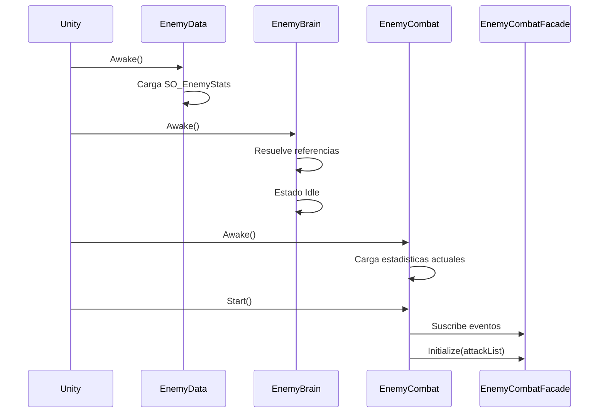

# Ciclo de vida

La inicializacion depende del orden de Unity y de la comunicacion entre componentes.

## Arranque

## Durante el juego

1. `EnemyBrain` recibe un objetivo mediante el collider de agro.
2. Cambia a `Combat` y evalua rango y disponibilidad.
3. `EnemyCombat` solicita una habilidad a `EnemyCombatFacade`.
4. La fachada reserva el ataque, aplica su cooldown y bloquea otra seleccion durante la duracion.
5. `BaseSkill` se instancia, inicializa el dano y crea el VFX.
6. El impacto comunica el dano mediante `ITakeDamage`.

## Destruccion

Una habilidad puede destruirse por tres rutas:

- Colision, si `ShouldDestroyUponCollision` esta activo.
- Fin del VFX, si `ShouldDestroyWhenVfxEnd` esta activo.
- Temporizador de seguridad `SkillSelfDestructionTimer`.

El collider puede destruirse antes que el objeto visual para evitar impactos posteriores.
