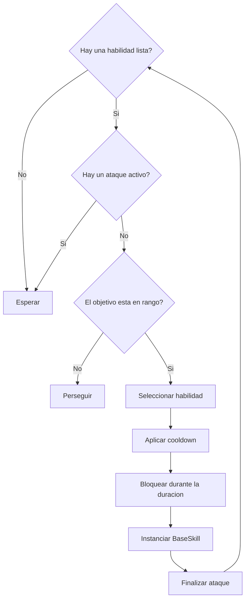

# Sistema de combate

El combate se divide en tres piezas: decision, coordinacion y seleccion.

## Responsabilidades

| Componente | Funcion |
|---|---|
| `EnemyBrain` | Decide cuando perseguir y cuando atacar. |
| `EnemyCombat` | Instancia la habilidad y le entrega atacante, objetivo y spawner. |
| `EnemyCombatFacade` | Mantiene la lista final, el indice rotativo y los cooldowns. |
| `BaseSkill` | Produce el efecto, detecta el impacto y calcula el dano. |

## Seleccion rotativa

La fachada comienza en `_index` y recorre la lista circularmente. El operador modulo hace que el ultimo elemento vuelva a la posicion cero:

```text
siguiente = (indiceActual + 1) % cantidadDeAtaques
```

Con un solo ataque, el indice siempre es `0`; el mismo ataque se reutiliza cuando queda disponible.

## Bloqueo del ataque

Un ataque solo puede reservarse si se cumplen estas condiciones:

- La fachada fue inicializada.
- Existe al menos una habilidad configurada.
- No hay otro ataque en duracion.
- Al menos una habilidad tiene cooldown igual o menor que cero.

El cooldown efectivo se establece como el mayor valor entre el cooldown configurado y la duracion del ataque. Esto evita que la siguiente habilidad se active antes de terminar la actual.



## VFX y dano

`BaseSkill.Initialize` recibe el dano base del enemigo y suma el dano propio de la habilidad. El VFX se instancia como hijo de la habilidad para que el offset visual no mueva el collider de impacto.

El collider notifica la entrada de otro objeto. `BaseSkill` busca `ITakeDamage` en los hijos del objeto impactado y ejecuta `TakeDamage`.

## Configuracion recomendada

- Usa un `BaseSkill` por tipo de ataque.
- Configura el rango del ataque y el radio del collider de forma coherente.
- Mantén `SkillDuration` igual o mayor que el tiempo visual relevante.
- Usa `SkillSelfDestructionTimer` como respaldo, no como temporizador principal.
