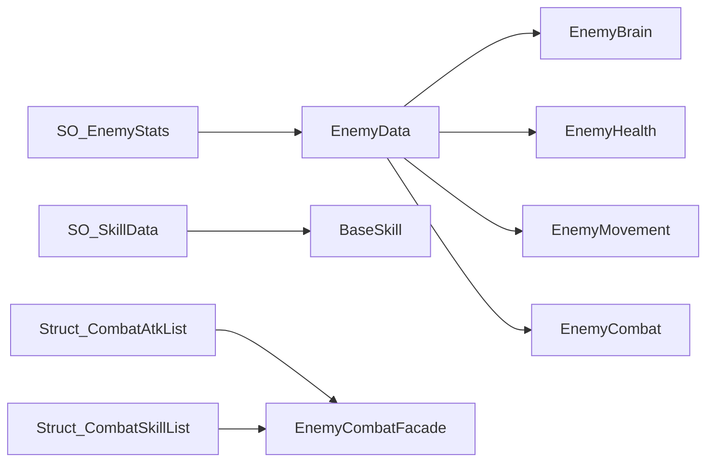

# Datos y configuracion

## `SO_EnemyStats`

Define los valores base del enemigo:

- Vida maxima.
- Velocidad.
- Dano base.
- Paciencia.
- Porcentaje de curacion.

`EnemyData` copia estos valores a `Struct_EnemyStatsData` y notifica los cambios mediante `OnDataChanged`.

## `SO_SkillData`

Centraliza los parametros reutilizables de una habilidad:

- Dano y rango.
- Cooldown y duracion.
- Temporizador de autodestruccion.
- Reglas de colision y dano.
- Seguimiento del spawner.
- Offset y escala del VFX.
- Lista de variantes visuales.

## Relacion de configuracion

## Estado frente a configuracion

No guardes cooldowns actuales, objetivos ni coroutines dentro de un `ScriptableObject`. Esos valores pertenecen a cada instancia del enemigo y se almacenan en `EnemyCombatFacade` o `EnemyBrain`.
