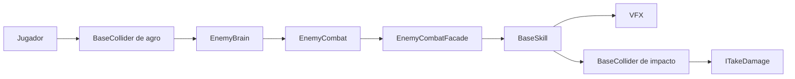

# Sistema modular de enemigos

Documentacion tecnica del sistema de enemigos desarrollado para **Dungeons Game**.

El sistema separa la toma de decisiones, el movimiento, la salud, los datos, las colisiones y el combate en componentes reutilizables. La referencia API se genera a partir de `Isai.Enemies.dll` y sus comentarios XML.

## Mapa rapido

| Area | Responsabilidad |
|---|---|
| `EnemyBrain` | Decide el estado, objetivo y comportamiento general. |
| `EnemyCombat` | Ejecuta la habilidad que entrega la fachada de combate. |
| `EnemyCombatFacade` | Selecciona ataques y controla cooldowns y duracion. |
| `BaseSkill` | Instancia VFX, collider y dano de una habilidad. |
| `BaseMovement` | Encapsula el `NavMeshAgent`. |
| `BaseHealth` | Gestiona vida, dano, muerte y curacion. |
| `EnemyData` | Distribuye las estadisticas configuradas. |

## Flujo general

## Como leer esta documentacion

- Empieza por [Arquitectura](arquitectura.md) para conocer las responsabilidades.
- Continua con [Combate](combate.md) si necesitas configurar ataques.
- Consulta [Datos y configuracion](datos-y-configuracion.md) para los `ScriptableObject`.
- Usa la [Referencia API](api/toc.yml) cuando necesites firmas concretas.
