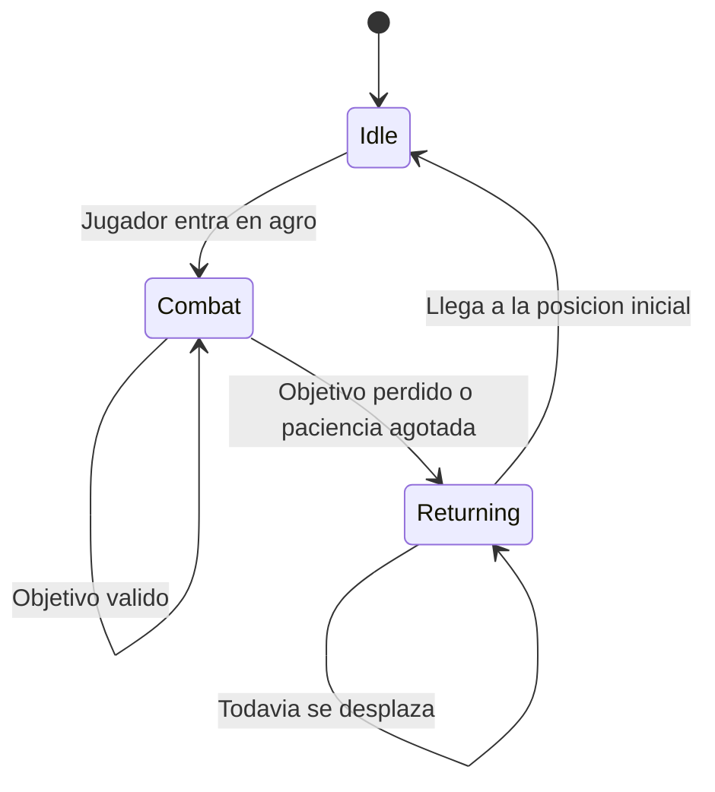

# Movimiento y estados

`EnemyBrain` utiliza cuatro estados principales:

| Estado | Comportamiento |
|---|---|
| `None` | Estado inicial sin comportamiento asignado. |
| `Idle` | Limpia el movimiento, recupera paciencia y puede iniciar curacion. |
| `Combat` | Rota hacia el objetivo, persigue y ejecuta ataques. |
| `Returning` | Regresa a la posicion inicial y despues vuelve a `Idle`. |

## Maquina de estados

## Paciencia

Cuando el enemigo se encuentra fuera del radio de persecucion, `ExecuteWait` inicia una cuenta regresiva. Si vuelve al area, la coroutine se detiene. Al llegar a cero, el objetivo se limpia y el enemigo retorna.

## Movimiento

`EnemyMovement` hereda de `BaseMovement` y toma la velocidad desde `EnemyData`. `BaseMovement` encapsula el `NavMeshAgent`, por lo que el cerebro solo necesita solicitar:

- `Move2Target` para establecer un destino.
- `StopMovement` durante un ataque o al entrar en rango.
- `ResumeMovement` para continuar la persecucion.
- `CleanMovement` al entrar en reposo.
